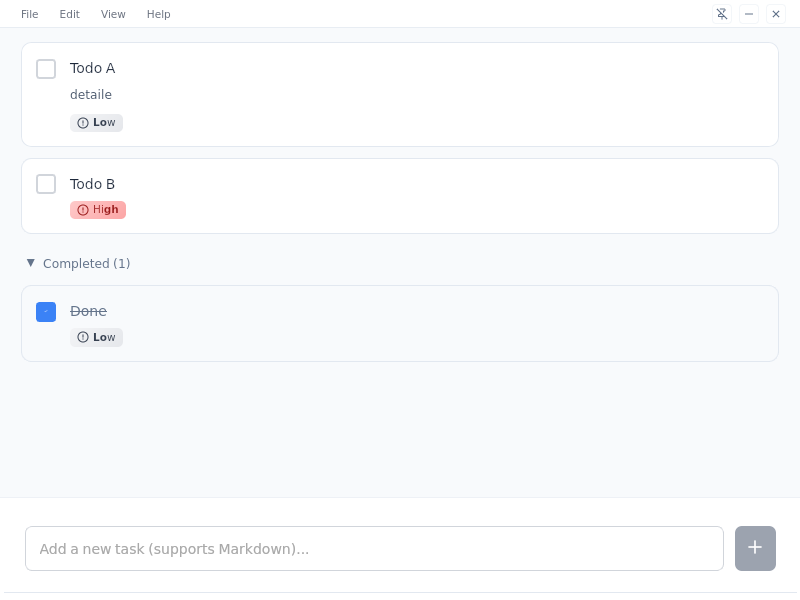
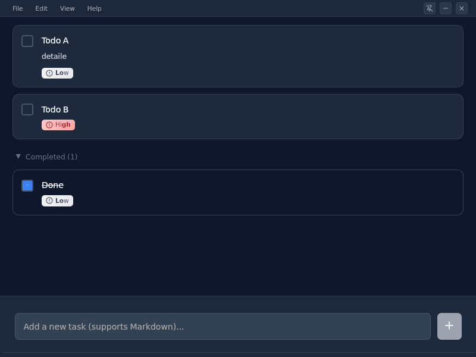
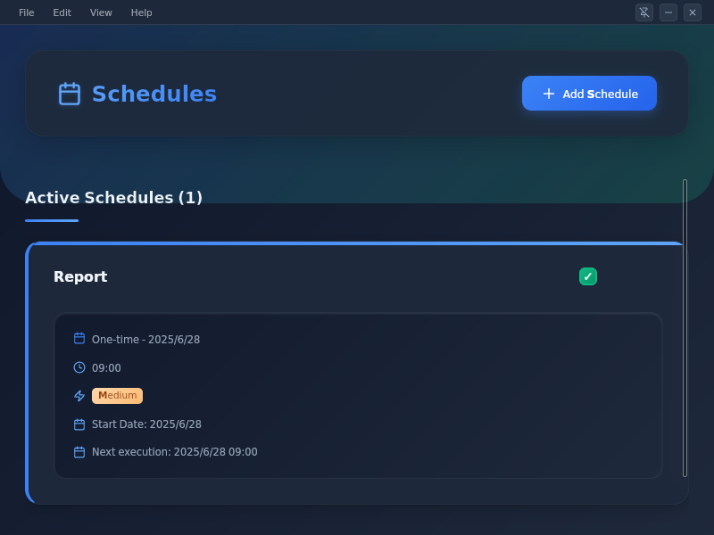
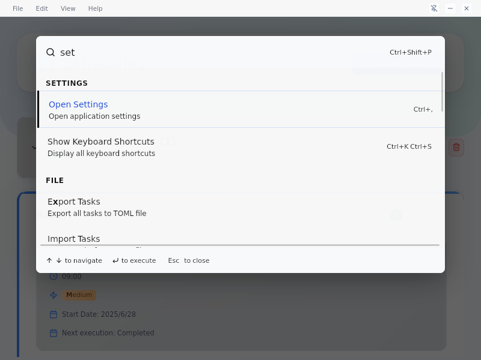
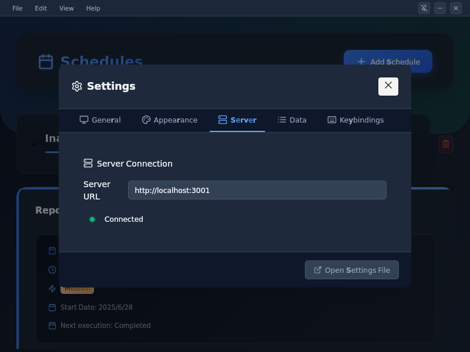
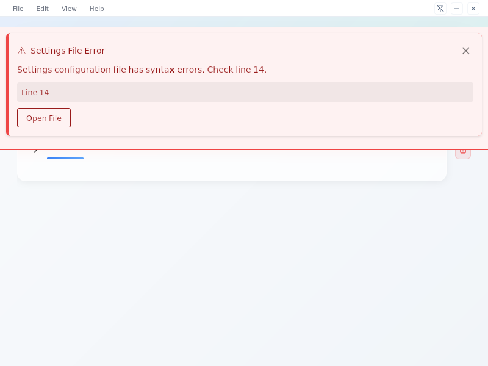

# YuToDo - Tauri Desktop Application

A modern, feature-rich todo list application built with Tauri, React, and TypeScript. This desktop app provides real-time synchronization, native file operations, Markdown support, comprehensive scheduling system, and extensive customization options.

[](https://tauri.app/)
[](https://reactjs.org/)
[](https://www.typescriptlang.org/)
[](https://github.com)
[](LICENSE)

<!-- [](https://github.com/your-username/yutodo/actions) -->
<!-- [](https://codecov.io/gh/your-username/yutodo) -->

## Table of Contents

- [Screenshots](#screenshots)
- [Features Overview](#features-overview)
- [Quick Start](#quick-start)
- [Features](#features)
- [Architecture](#architecture)
- [Development Setup](#development-setup)
- [Build Commands](#build-commands)
- [Configuration](#configuration)
- [Keyboard Shortcuts](#keyboard-shortcuts)
- [Command Palette](#command-palette)
- [Internationalization](#internationalization)
- [Database Architecture](#database-architecture)
- [API Endpoints](#api-endpoints)
- [Technology Stack](#technology-stack)
- [E2E Testing](#e2e-testing)
- [WSLg Environment Support](#wslg-environment-support)
- [Contributing](#contributing)
- [Known Issues](#known-issues)
- [Troubleshooting](#troubleshooting)

## Screenshots

### Main Interface - Light Mode


### Main Interface - Dark Mode  


### Schedule Management


### Command Palette


### Settings Panel


### TOML Error Handling


> **📸 Note**: Screenshots are placeholders. See [`docs/SCREENSHOT_GUIDE.md`](docs/SCREENSHOT_GUIDE.md) for instructions on capturing actual application screenshots.

## Features Overview

**YuToDo** combines the power of modern web technologies with native desktop performance to deliver a comprehensive task management solution. The application features a clean, intuitive interface that adapts to your workflow, whether you prefer keyboard shortcuts, drag-and-drop interactions, or menu navigation.

### ✨ Key Highlights
- **🚀 Real-time synchronization** across multiple app instances
- **🎨 Adaptive theming** with automatic dark/light mode detection  
- **⌨️ Keyboard-first design** with VSCode-style command palette
- **📱 Cross-platform** desktop app with native file system integration
- **🌐 Multilingual** support (English/Japanese) with extensible i18n
- **⚙️ Advanced configuration** with TOML files and comprehensive error handling

## Quick Start

### 🚀 Try it Now
```bash
# Clone and run (requires Node.js and Rust)
git clone <repository-url>
cd yutodo
npm install && cd server && npm install && cd ..

# Start backend server
cd server && npm run dev &

# Start desktop app  
npm run tauri dev
```

### 📦 Download Release
<!-- Download pre-built binaries from [Releases](https://github.com/your-username/yutodo/releases) -->
*Pre-built releases coming soon*

### ✨ First Steps
1. **Create your first task** - Click the input at the bottom or press `Ctrl+N`
2. **Try keyboard shortcuts** - Press `Ctrl+Shift+P` for the command palette
3. **Explore scheduling** - Press `Ctrl+3` to switch to schedule view
4. **Customize appearance** - Press `Ctrl+,` to open settings

## Features

### Core Functionality
- ✅ **Real-time synchronization** - Multiple instances stay synchronized via WebSocket
- ✅ **Drag & drop reordering** - Intuitive task organization
- ✅ **Inline editing** - Double-click to edit tasks directly with cursor positioning
- ✅ **Priority system** - High, Medium, Low priority levels with visual indicators
- ✅ **Due dates** - Schedule tasks with optional due dates and overdue detection
- ✅ **Schedule management** - Comprehensive scheduling with once/daily/weekly/monthly/custom recurrence
- ✅ **Search & filtering** - Find tasks by content, status, priority, or overdue status
- ✅ **Multi-selection** - Excel-like task selection with Shift+Click (range) and Ctrl+Click (individual)
- ✅ **Delete confirmation** - Optional confirmation dialogs (configurable)
- ✅ **Markdown support** - Full Markdown rendering in task titles and descriptions
- ✅ **Completed tasks section** - Collapsible section for completed tasks with expand/collapse toggle

### User Interface
- 🎨 **Dark/Light themes** - Auto-detect system preference or manual selection
- 🌐 **Internationalization** - Full English/Japanese language support with app-controlled persistence
- 📱 **Slim mode** - Compact view with priority, date, and description display
- 🎯 **Auto-hiding header** - Clean interface that appears on mouse hover
- ⌨️ **VSCode-style command palette** - Quick access to all commands with Ctrl+Shift+P (Cmd+Shift+P on macOS)
- ⌨️ **Centralized keyboard shortcuts** - Unified shortcut system with OS-aware display (Ctrl/Cmd)
- ⌨️ **Comprehensive keyboard navigation** - Full support for keyboard-only operation
- 🎨 **Custom CSS injection** - Personalize the appearance with custom styles
- 🔗 **Interactive links** - Click Markdown links to open in default browser
- 📋 **Right-click context** - Right-click links to copy URLs to clipboard
- ✨ **Visual feedback** - Animated selection indicators and smooth transitions
- 🎯 **Precise editing** - Click-to-position cursor in task editing with canvas-based positioning
- 📋 **Header menu system** - Integrated File/Edit/View/Help menus with keyboard shortcuts and dropdown navigation

### Schedule System
- 📅 **Schedule types** - Once, Daily, Weekly, Monthly, and Custom recurrence patterns
- ⏰ **Time-based execution** - Set specific times for schedule execution
- 📆 **Date ranges** - Start and end dates for recurring schedules
- 🚫 **Weekend exclusion** - Option to skip weekends for daily schedules
- 📊 **Active/Inactive categorization** - Automatic organization of completed and inactive schedules
- 🗑️ **Bulk operations** - Delete all inactive schedules with confirmation
- 🔄 **Real-time sync** - Schedule changes synchronized across all clients

### Data Management & Export/Import
- 💾 **SQLite database** - Reliable local data storage with OS-standard location
  - **Linux**: `~/.local/share/yutodo-server/todos.db`
  - **Windows**: `%APPDATA%/YuToDo Server/Data/todos.db` 
  - **macOS**: `~/Library/Application Support/YuToDo Server/Data/todos.db`
- 🔄 **Automatic initialization** - Database and tables created automatically on first run
- 🔄 **Automatic migration** - Seamless migration from old database location
- 📁 **Directory creation** - Data directories automatically created if they don't exist
- 📤 **Native file operations** - Full Tauri-native file dialogs for export/import
- 📄 **TOML export/import** - Unified format for tasks using standard `[[tasks]]` table syntax
- ⚙️ **TOML configuration** - Human-readable settings file with JSON Schema validation
- 🔄 **Auto-save** - Settings and tasks automatically persisted
- 📋 **Clipboard fallback** - Automatic clipboard copy when native save fails (WSLg support)
- 📊 **Server configuration** - Comprehensive server-side configuration management

### Desktop Integration
- 📌 **Always on top** - Keep the app visible above other windows
- 🪟 **Custom window controls** - Minimize, close, and drag functionality
- 🔧 **Native dialogs** - System-native file save/open dialogs via Tauri plugins
- 🖥️ **Cross-platform** - Works on Windows, macOS, and Linux (with WSLg considerations)
- 📋 **System clipboard** - Native clipboard integration for URL copying and data export

## Architecture

### Frontend (React + TypeScript + Vite)
- **Framework**: React 18 with TypeScript
- **Build Tool**: Vite for fast development and building
- **UI Components**: Custom components with Lucide React icons
- **Drag & Drop**: @dnd-kit for modern drag and drop functionality
- **Date Handling**: react-datepicker for scheduling
- **Real-time**: Socket.IO client for WebSocket communication
- **Configuration**: @ltd/j-toml for TOML parsing and generation
- **Markdown**: react-markdown with remark-gfm for GitHub Flavored Markdown
- **i18n**: react-i18next for internationalization

### Backend (Node.js + Express)
- **Server**: Express.js with TypeScript
- **Database**: SQLite3 with OS-standard data directory location
- **Real-time**: Socket.IO for WebSocket communication
- **API**: RESTful endpoints for todo and schedule operations
- **Schema**: Automatic database initialization and migration
- **Configuration**: Comprehensive TOML-based server configuration system
- **Schedule Engine**: Server-side schedule execution engine

### Desktop (Tauri v2 + Rust)
- **Framework**: Tauri v2 for modern cross-platform desktop apps
- **Plugins**:
  - `tauri-plugin-dialog` - Native file dialogs
  - `tauri-plugin-fs` - Secure file system access
  - `tauri-plugin-opener` - System integration and URL handling
  - `tauri-plugin-clipboard-manager` - Native clipboard operations
- **Window Management**: Native window controls and system integration
- **Security**: Capability-based permissions system
- **Performance**: Rust backend with web frontend for optimal performance

## Development Setup

### Prerequisites
- Node.js (v16+)
- Rust (latest stable)
- npm or yarn

### Installation

1. **Clone the repository**
   ```bash
   git clone <repository-url>
   cd yutodo
   ```

2. **Install frontend dependencies**
   ```bash
   npm install
   ```

3. **Install backend dependencies**
   ```bash
   cd server
   npm install
   cd ..
   ```

### Development Workflow

1. **Start the backend server**
   ```bash
   cd server
   npm run dev
   ```

2. **Start the Tauri development app**
   ```bash
   npm run tauri dev
   ```

The app will connect to the server at `http://localhost:3001` by default. The frontend development server automatically selects an available port starting from 1420.

## Build Commands

### Frontend (React + Vite)
```bash
npm run dev          # Start Vite dev server (auto-selects port)
npm run build        # Build React app and TypeScript
npm run preview      # Preview built app
npm test             # Run frontend tests with Vitest
npm run test:ui      # Run tests with interactive UI
npm run lint         # Run ESLint on source files
npm run lint:fix     # Fix ESLint issues automatically
```

### Backend (Node.js Server)
```bash
cd server
npm run dev          # Start server with ts-node
npm run build        # Compile TypeScript
npm run start        # Run compiled server
npm test             # Run backend tests with Jest
npm run test:watch   # Run tests in watch mode
npm run test:parallel # Run tests in parallel
```

### Desktop (Tauri)
```bash
npm run tauri dev    # Start Tauri development mode
npm run tauri build  # Build Tauri desktop app for distribution
```

### Testing
```bash
# Frontend testing (from root directory)
npm test                           # Run all frontend tests (346+ tests)
npm test src/test/TodoItem.test.tsx # Run specific test file
npm test -- --run                  # Run tests once (no watch mode)
npm run test:ui                    # Interactive test UI with Vitest

# Backend testing (from server directory)
cd server
npm test                          # Run all backend tests (58 tests)
npm run test:watch                # Watch mode for TDD
npm test -- --testNamePattern="socket" # Run specific test patterns

# E2E testing with WebdriverIO
npm run test:e2e                  # Run E2E tests headlessly
npm run test:e2e:ui               # Run with visible browser
npm run test:e2e:headed           # Alternative headed mode
npm run setup:e2e                 # Install tauri-driver and WebDriver
```

## Configuration

### Client Settings File (TOML)
The app supports a comprehensive TOML configuration file with the following structure:

```toml
# YuToDo Configuration
# Generated on 2025-06-14T12:34:56.789Z

[app]
alwaysOnTop = false
detailedMode = false
darkMode = "auto"  # "auto" | "light" | "dark"
confirmDelete = true
customCss = ""
serverUrl = "http://localhost:3001"
language = "auto"  # "auto" | "en" | "ja"
currentView = "tasks"  # "tasks" | "schedules"
```

### Server Configuration
The server supports comprehensive configuration through environment variables and TOML files:

```bash
# Environment variables
YUTODO_SERVER_PORT=8080          # Server port
YUTODO_SERVER_HOST=0.0.0.0       # Server host
YUTODO_DB_PATH=/custom/todos.db   # Database file path
YUTODO_LOG_LEVEL=debug           # Logging level
YUTODO_SCHEDULE_INTERVAL=120     # Schedule check interval (seconds)
YUTODO_CONFIG_PATH=/etc/yutodo/server-config.toml  # Config file path
```

### Configuration Management
- **Export Settings**: Save current configuration as TOML file
- **Import Settings**: Load configuration from TOML file with validation
- **Reset to Defaults**: Restore all settings to default values
- **Live Updates**: Settings applied immediately without restart
- **Validation**: JSON Schema validation for configuration integrity

## Keyboard Shortcuts

### Essential Shortcuts
| Shortcut | Action |
|----------|--------|
| `Ctrl+Shift+P` | Open command palette |
| `Ctrl+N` | Create new task |
| `Ctrl+,` | Toggle settings |
| `Ctrl+F` | Focus search |
| `Ctrl+A` | Select all tasks |
| `Ctrl+D` | Toggle task completion |
| `Delete` | Delete selected tasks |
| `Ctrl+K, Ctrl+S` | Show keyboard shortcuts help |

### Navigation & Editing
| Shortcut | Action |
|----------|--------|
| `↑/↓` | Navigate between tasks |
| `E` or `F2` | Edit selected task |
| `Enter` | Confirm action/Complete editing |
| `Escape` | Cancel action/Close dialogs/Clear selection |
| `Space` | Quick add new task (when no task selected) |
| `Double Click` | Edit task title with cursor positioning |

### Selection
| Shortcut | Action |
|----------|--------|
| `Shift + Click` | Range selection |
| `Ctrl + Click` | Toggle individual selection |
| `Shift + ↑/↓` | Extend selection |

### Menu Navigation
| Shortcut | Action |
|----------|--------|
| `Alt+F` | Open File menu |
| `Alt+E` | Open Edit menu |
| `Alt+V` | Open View menu |
| `Alt+H` | Open Help menu |

## Command Palette

Access all application commands quickly with `Ctrl+Shift+P` (or `Cmd+Shift+P` on macOS). The command palette includes:

### Categories
- **File**: Import/Export tasks, New task
- **View**: Toggle theme, slim mode, task/schedule view
- **Task**: Create, edit, delete, toggle completion
- **Schedule**: Create schedule, delete inactive schedules
- **Search**: Focus search, clear search
- **Settings**: Open settings, toggle confirmations
- **Navigation**: Various navigation commands

Commands are searchable with fuzzy matching and show their keyboard shortcuts for learning.

## Internationalization

### Supported Languages
- **English** - Full support with native UI text
- **Japanese (日本語)** - Complete translation coverage
- **Auto-detection** - Automatically detects system language preference

### Language Features
- **Real-time switching** - Change language instantly without restart
- **Persistent settings** - Language preference saved in both localStorage and TOML config
- **Fallback system** - Graceful fallback to English for missing translations
- **Type-safe translations** - TypeScript integration for translation keys
- **OS-aware labels** - Keyboard shortcuts show Ctrl (Windows/Linux) or Cmd (macOS)

### Adding New Languages
To contribute translations:
1. Create `src/i18n/locales/[language].json`
2. Add to `resources` in `src/i18n/index.ts`
3. Update `supportedLanguages` object
4. Update language selector in Settings component

## Database Architecture

### Database Initialization

The application automatically handles database setup with no manual configuration required:

1. **First Run Setup**
   - Server automatically creates data directories if they don't exist
   - SQLite database file is created with proper schema on first startup
   - All required tables (`todos`, `schedules`) are initialized automatically

2. **Migration Handling**
   - Automatically detects existing databases in old locations
   - Migrates data seamlessly to new OS-standard locations
   - Preserves all existing todos and schedules during migration

3. **Error Recovery**
   - Handles corrupted database files gracefully
   - Recreates tables if schema issues are detected
   - Logs migration and initialization process for troubleshooting

### Database Schema

**Table `todos`:**
- `id` (TEXT PRIMARY KEY) - Unique task identifier
- `title` (TEXT NOT NULL) - Task title (supports Markdown)
- `description` (TEXT) - Optional task description (supports Markdown)
- `completed` (BOOLEAN) - Completion status
- `priority` (INTEGER, 0-2) - Legacy numeric format (converted to strings in app)
- `scheduledFor` (DATETIME) - Optional due date
- `createdAt` (DATETIME) - Creation timestamp
- `updatedAt` (DATETIME) - Last modification timestamp
- `order_index` (INTEGER) - Custom ordering for drag & drop

**Table `schedules`:**
- `id` (TEXT PRIMARY KEY) - Unique schedule identifier
- `title` (TEXT NOT NULL) - Schedule title
- `description` (TEXT) - Optional description
- `type` (TEXT) - Schedule type: once, daily, weekly, monthly, custom
- `startDate` (TEXT) - Schedule start date
- `endDate` (TEXT) - Optional end date
- `time` (TEXT) - Execution time
- `priority` (TEXT) - Priority: high, medium, low
- `excludeWeekends` (BOOLEAN) - Skip weekends for daily schedules
- `weeklyConfig` (TEXT) - JSON configuration for weekly schedules
- `monthlyConfig` (TEXT) - JSON configuration for monthly schedules
- `customConfig` (TEXT) - JSON configuration for custom schedules
- `isActive` (BOOLEAN) - Active/inactive status
- `lastExecuted` (TEXT) - Last execution timestamp
- `nextExecution` (TEXT) - Next scheduled execution
- `createdAt` (TEXT) - Creation timestamp
- `updatedAt` (TEXT) - Last modification timestamp

## API Endpoints

### REST API
- `GET /api/todos` - Get all todos
- `POST /api/todos` - Create new todo
- `PUT /api/todos/:id` - Update todo
- `DELETE /api/todos/:id` - Delete todo
- `POST /api/todos/reorder` - Update todo ordering

### Schedule API
- `GET /api/schedules` - Get all schedules
- `POST /api/schedules` - Create new schedule
- `PUT /api/schedules/:id` - Update schedule
- `DELETE /api/schedules/:id` - Delete schedule
- `PUT /api/schedules/:id/toggle` - Toggle schedule active status

### WebSocket Events (Socket.IO)
#### Todo Events
- `todos:list` - Get current todos list
- `todo:add` - Add new todo
- `todo:update` - Update existing todo
- `todo:delete` - Delete todo
- `todo:toggle` - Toggle completion status
- `todos:reorder` - Reorder todos

#### Schedule Events
- `schedules:list` - Get current schedules list
- `schedule:add` - Add new schedule
- `schedule:update` - Update existing schedule
- `schedule:delete` - Delete schedule
- `schedule:toggle` - Toggle schedule active status

## Technology Stack

### Frontend
- **React 18** - Modern React with hooks and concurrent features
- **TypeScript** - Type-safe JavaScript
- **Vite** - Fast build tool and dev server
- **@dnd-kit** - Modern drag and drop library
- **Socket.IO Client** - Real-time communication
- **Lucide React** - Beautiful icon library
- **React DatePicker** - Date selection component
- **react-markdown** - Markdown rendering with remark-gfm
- **@ltd/j-toml** - TOML parsing and stringification
- **react-i18next** - Internationalization framework

### Backend
- **Node.js** - JavaScript runtime
- **Express.js** - Web framework
- **TypeScript** - Type-safe server code
- **Socket.IO** - Real-time WebSocket communication
- **sqlite3** - SQLite database driver
- **uuid** - Unique identifier generation
- **zod** - Schema validation for configuration

### Desktop (Tauri v2)
- **Tauri v2** - Modern Rust-based desktop framework
- **Rust** - Systems programming language
- **tauri-plugin-dialog** - Native file dialogs
- **tauri-plugin-fs** - Secure file system operations
- **tauri-plugin-opener** - System integration
- **tauri-plugin-clipboard-manager** - Clipboard operations

### Testing
- **Vitest** - Fast unit testing for frontend (346+ tests)
- **Jest** - Comprehensive testing for backend (58 tests)
- **React Testing Library** - Component testing
- **WebdriverIO** - E2E testing with Tauri WebDriver
- **@testing-library/user-event** - User interaction simulation

## E2E Testing

### Setup
```bash
# Install tauri-driver and platform WebDriver
npm run setup:e2e

# Linux additional requirement
sudo apt install webkit2gtk-driver

# Windows: Download Edge WebDriver for your Edge version
```

### Running E2E Tests
```bash
npm run test:e2e          # Headless mode
npm run test:e2e:headed   # With visible browser
npm run test:e2e:ui       # Interactive mode
```

### Platform Support
- ✅ **Linux**: webkit2gtk-driver + Xvfb for CI
- ✅ **Windows**: Edge WebDriver
- ❌ **macOS**: Not supported (no WKWebView driver)

### Test Coverage
- App launch and UI validation
- Todo CRUD operations
- Keyboard shortcuts and navigation
- Window operations and menus
- Schedule management
- Command palette interactions

## WSLg Environment Support

The app automatically detects and handles WSLg (Windows Subsystem for Linux GUI) environments:

### URL Handling
- First attempts native browser opening
- Falls back to clipboard copy with notification
- Right-click always available for manual copy

### File Operations
- Native dialogs attempted first
- Clipboard export as fallback
- Clear user guidance for limitations

### Graphics
Normal warnings that don't affect functionality:
```
libEGL warning: DRI3: Screen seems not DRI3 capable
MESA: error: ZINK: failed to choose pdev
```

Suppress with: `export LIBGL_ALWAYS_SOFTWARE=1`

## Contributing

1. Fork the repository
2. Create a feature branch
3. Make your changes
4. **Write tests** - All new features must include tests
5. **Run validation** - Ensure all checks pass:
   ```bash
   npm run lint          # No errors allowed
   npm run build         # Must succeed
   npm test -- --run     # All 346+ tests must pass
   cd server && npm test # All 58 tests must pass
   ```
6. Submit a pull request

### Testing Requirements
- **Component Tests**: Add to `src/test/`
- **Backend Tests**: Add to `server/__tests__/`
- **E2E Tests**: Add to `e2e/tests/`
- **100% Pass Rate**: All tests must pass
- **Clean Output**: No console errors in tests

## Known Issues

### Keyboard Behavior
- **Enter Key**: May occasionally cause unresponsive state when task selected
  - **Workaround**: Use `E` or `F2` for editing, press `Escape` to clear
  - **Status**: Focus management issue under investigation

## Troubleshooting

### Common Issues

1. **Server Connection**: Ensure server running on port 3001
2. **Database Issues**: Database is automatically created - no manual setup needed
   - Data directories are created automatically on first run
   - Old databases are migrated automatically to new locations
   - Check server logs if migration fails
3. **File Operations**: Check Tauri permissions in `capabilities/default.json`
4. **Build Failures**: Update Rust toolchain: `rustup update`
5. **Test Failures**: Run full test suite to identify issues
6. **WSLg Limitations**: Use clipboard fallbacks for file/URL operations

### Debug Mode
```bash
npm run tauri dev  # Access browser DevTools with F12
```

## License

This project is licensed under the MIT License - see the LICENSE file for details.

## Recommended IDE Setup

- [VS Code](https://code.visualstudio.com/) + [Tauri](https://marketplace.visualstudio.com/items?itemName=tauri-apps.tauri-vscode) + [rust-analyzer](https://marketplace.visualstudio.com/items?itemName=rust-lang.rust-analyzer)
- TypeScript and ESLint extensions for optimal development experience